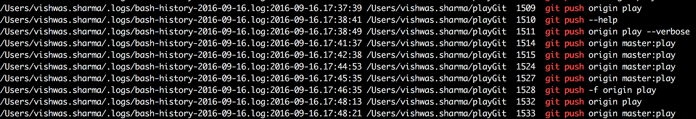

# dot-files
Collection of dot-files I use to configure my vim, bash and tmux. Constructed over time, by adding snippets, written by me and by generous authors in various forums on the internet.

## iOS and Linux support
Subtle command differences between iOS and Linux shell environments (rsync etc) are handled by the scripts.

## Installation
- Download or clone the repository with
``` bash
git clone https://github.com/csurfer/dot-files.git
```
- Set execution permission on `dot-files/install.sh`
- Execute `./dot-files/install.sh` to set up all the environments.
- Execute `source ~/.bash_profile` to enable bash settings.
- Enter a tmux session by using `tmux` and then `tmux source ~/.tmux.conf` to enable tmux settings.

## What is set ?

### vim
- Sets [vimified](https://github.com/zaiste/vimified).
- Sets [solarized-dark](https://github.com/altercation/vim-colors-solarized) theme.
- Allows for [Google search](https://github.com/szw/vim-g) from vim command line.
  - `:Google <search_word>` To search the word.
  - `:Google '<search_phrase>'` To search the phrase.
  - Use `:Googlef` instead of `:Google` to do current file specific queries. i,e `:Googlef` search from a python file would return python specific results and so on.
- Allows for [StackOverflow search](https://github.com/hienvd/vim-stackoverflow) from vim command line.
  - `:SO <search_word>` To search the word.
  - `:SO '<search_phrase>'` To search the phrase.
  - Use `:SOf` instead of `:SO` to do current file specific queries. i,e `:SOf` search from a python file would return python specific results and so on.

### tmux
- Sets [base16](https://github.com/chriskempson/base16) which provides similar display in both iOS and Linux environments.
- Adds Date, Time and Box name to the bottom right.


### bash shortcuts
Note: Your `~/.bashrc` is untouched. Your `~/.bash_aliases` will get copied to `~/.bash_extras`. Continue to use `~/.bash_extras` to store your bash shortcuts)
- Adds checks so that you do not lose files by mistake.
  - `rm` => `rm -i`
  - `cp` => `cp -iv`
  - `mv` => `mv -i`
- Adds navigation shortcuts.
  - `cd ../../..` =>  `...`
- Adds shortcuts for most used `git` commands.
  - `git status` => `gs`
  - `git branch` => `gb` (Also supports branch search with regex).
  - Pretty formated git log => `gl`
- Adds rsync capability to copy directory subtrees from one place to another.
  - `copy_files <src> <dest>` Copies files in source subtree to destination maintaining the directory structure.
- Adds rsync capability to move uncommitted git files around.
  - `push_git_files <dest>` Copies the uncommitted git files from current directory to destination.

### Unlimited History
Logs all bash commands executed by you into `~/.logs` in date wise log files. Searching something that you think you executed some time ago is as simple as

`hs <search_word>` or `hs '<search_phrase>'`

Logging is done in the following format.

`<filename>:<timestamp> <directory> <history number> <command>`

Output looks like



As the output is sorted you can use the history number as `!<number>` to execute the command again. This is not always supported as this tool specifically helps you to have an unlimited history of commands you executed and as a result if the command is not in your current bash history then `!<number>` wouldn't succeed.
